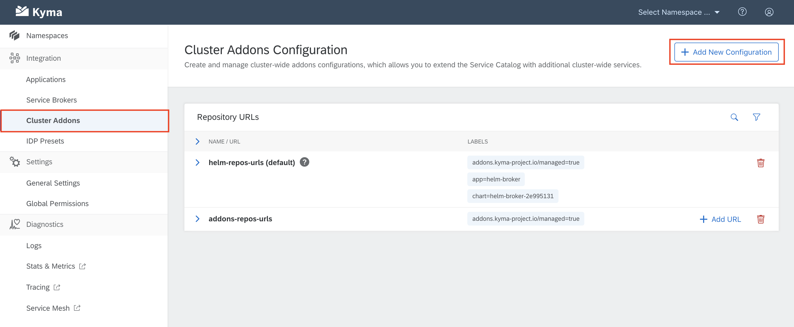
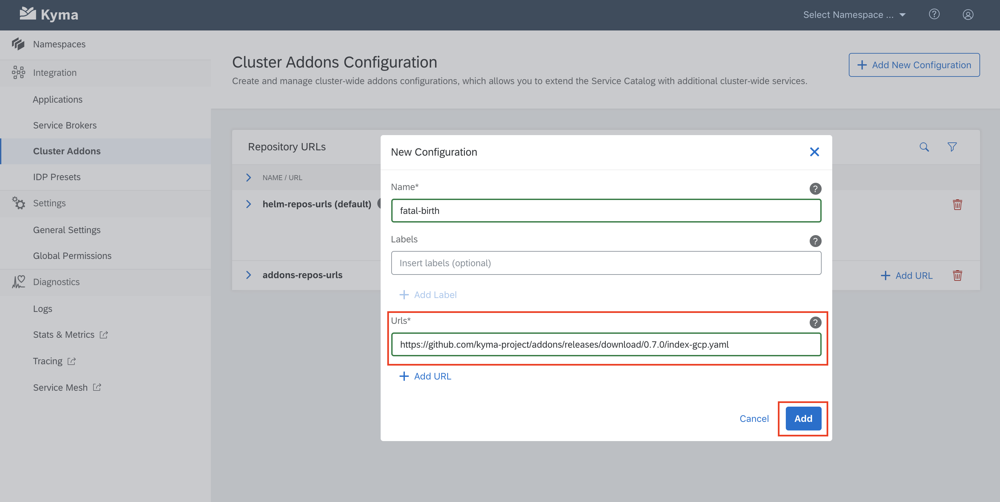
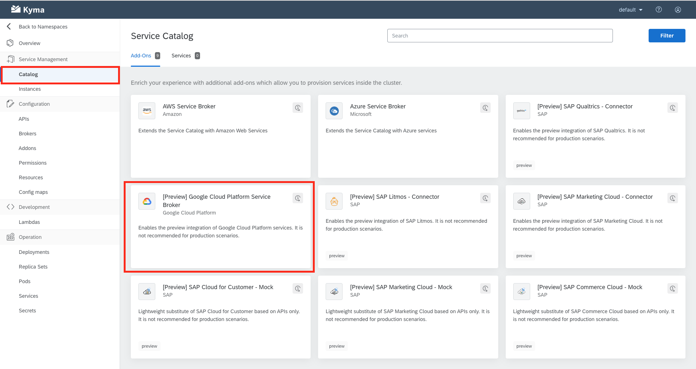
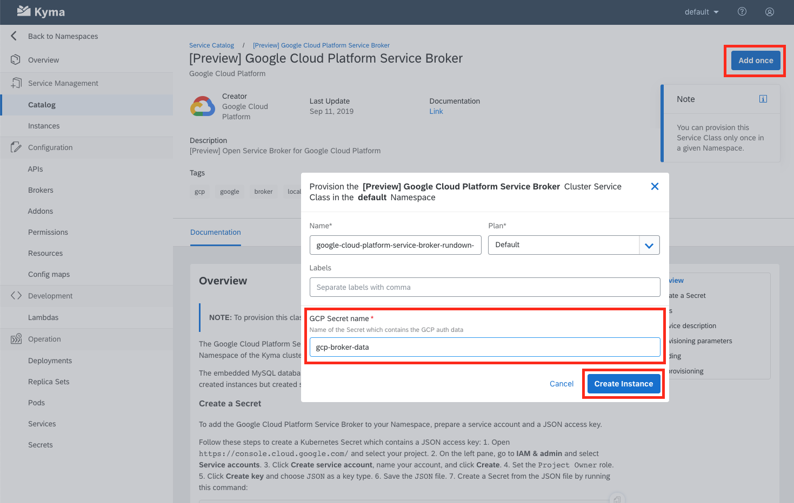

# Google Cloud Platform Service Broker - Configuration

## About

In this part of the session you are going to setup a service broker configuration to [Google Cloud Platform](https://github.com/GoogleCloudPlatform/gcp-service-broker).  This will provide the resources within the namespace access to various services available on the Google Cloud Platform, for example cloud storage which we will be using in a later exercise.  

## Addons-Configuration

In the home workspace of you Kyma envirnoment choose the `Cluster Addons` menu option and then choose `Add New Configuration`

Provide the following URL and then choose `Add`

`https://github.com/kyma-project/addons/releases/download/0.7.0/index-gcp.yaml`

## Deploy Secret

In these steps we will deployment a Kubernetes secret file which contains the necessary authentication information to configure the Service Broker connection to the Google Cloud Platform.  The steps necessary to obtain the authentication information will have already been done by your instructor and are detailed within the Google Cloud Platform Service Broker - Service Catalog Tile.  We will simply deploy the Kubernetes secret as apposed to generating it.

Within the context of your namespace choose the `Oveview` menu option and then choose `Deploy new resource`

The secret will need to be populated by your instructor before you can use it.  Download the [secret.yaml](secret.yaml) and then upload it to your instance by choosing the `Select` button and navigating to where you have it saved.  Choose the `Upload` button when complete.

## Create the Service Instance

Within the context of your namespace choose the `Catalog` menu option and then choose `Google Cloud Platform Service Broker`:

Choose the `Add once` button and provide the GCP Secret name and finally choose `Create Instance`

`GCP Secret name:  gcp-broker-data`

