# Installing Commerce Mock

To simulate a SAP Commerce Cloud System for the exercises, we will use a mmock based on the [Varkes](https://github.com/kyma-incubator/varkes) mocking framework. This will allow us to maintain a small resource footprint and as well simulate the relevant parts of SAP Commerce Cloud.

To install Varkes, first open the Kyma Console and from `Select Namespace` section, click on `Create New Namespace`. Fill the name field and create a Namespace:

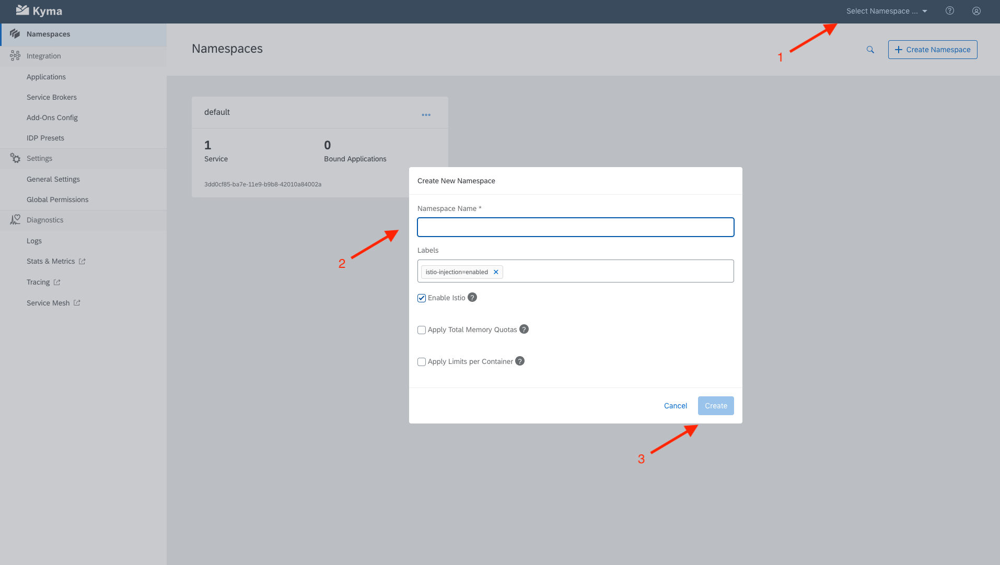

Go to the Namespace and click on `Catalog` under `Service Management`. Click on `[Preview] SAP Commerce Cloud - Mock`:

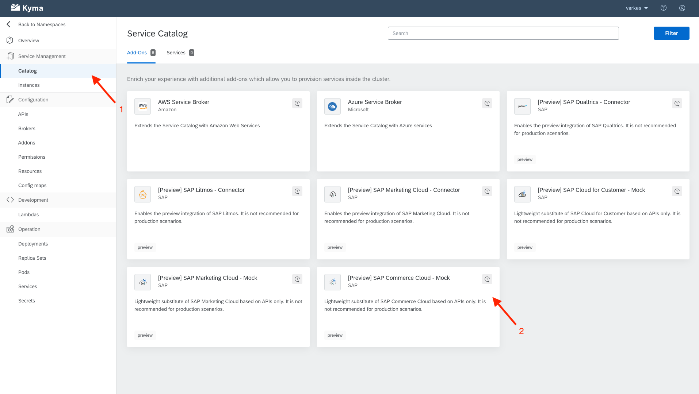

Click on `Add once` to install the mock to your namespace (leave default values):

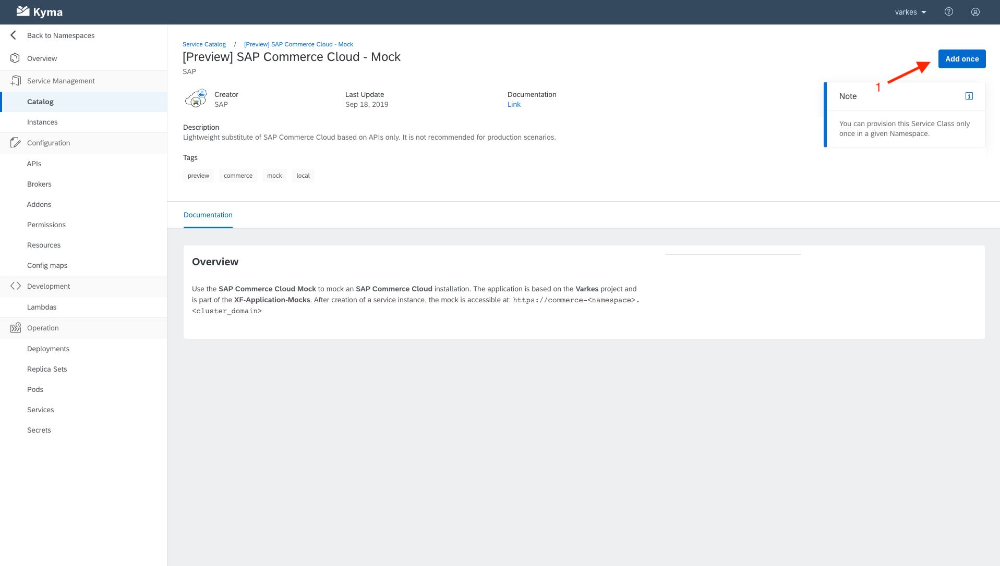

Go to Kyma homepage and choose `Applications`. Click on `Create Application` and provide the Name `commerce`:

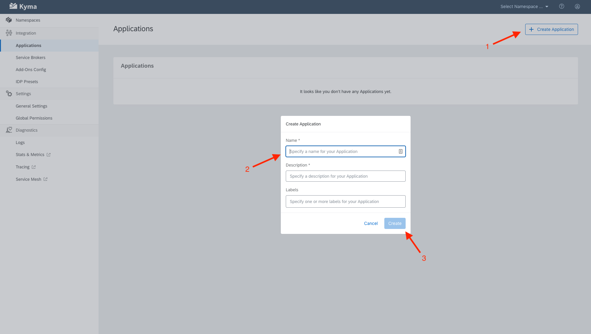

Choose the created application from the list and click on `Create Binding` from the `Namespace Bindings` section. Choose the `default` namespace and create the binding:

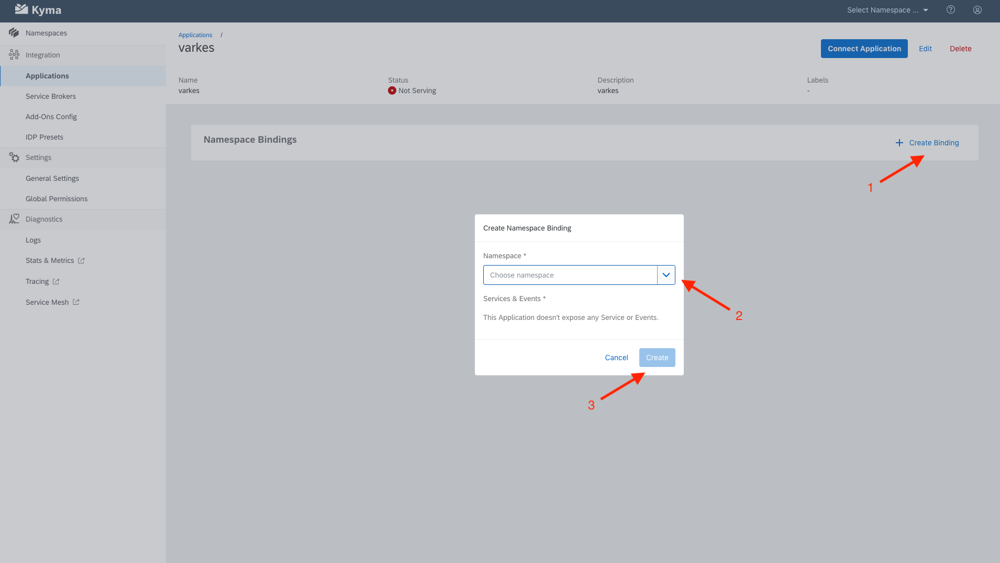

Click on `Connect Application`. This will generate a URL which will be feeded to Varkes to establish the connection between Varkes and Kyma. Copy the URL to the clipboard:

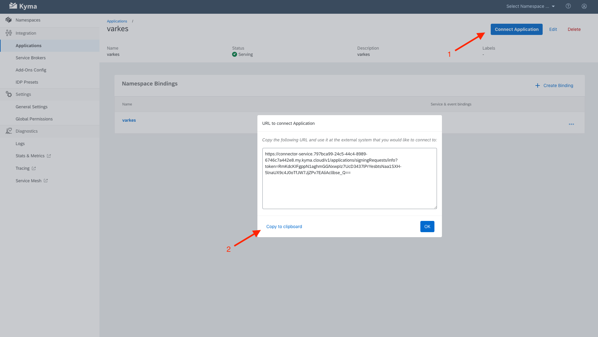

Go back to the namespace you created earlier and click on `APIs` and then the hostname of the `commerce-mock` application to access Varkes:

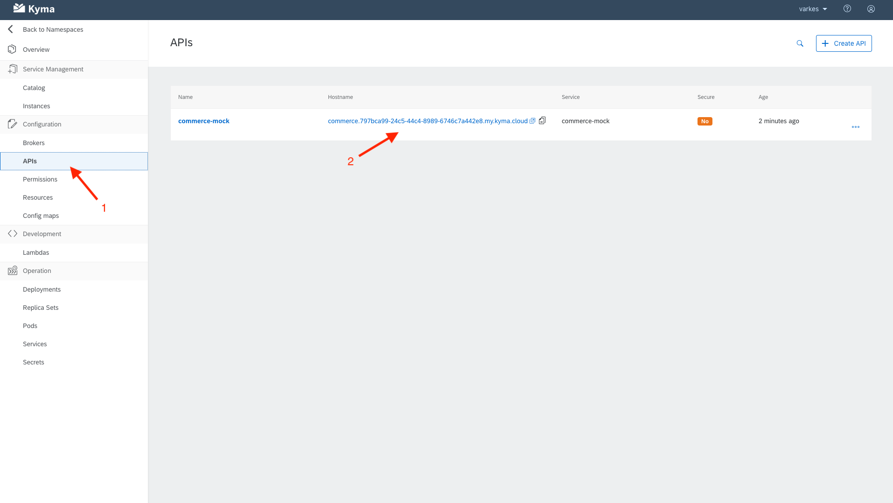

From Varkes homepage, click on Connect:

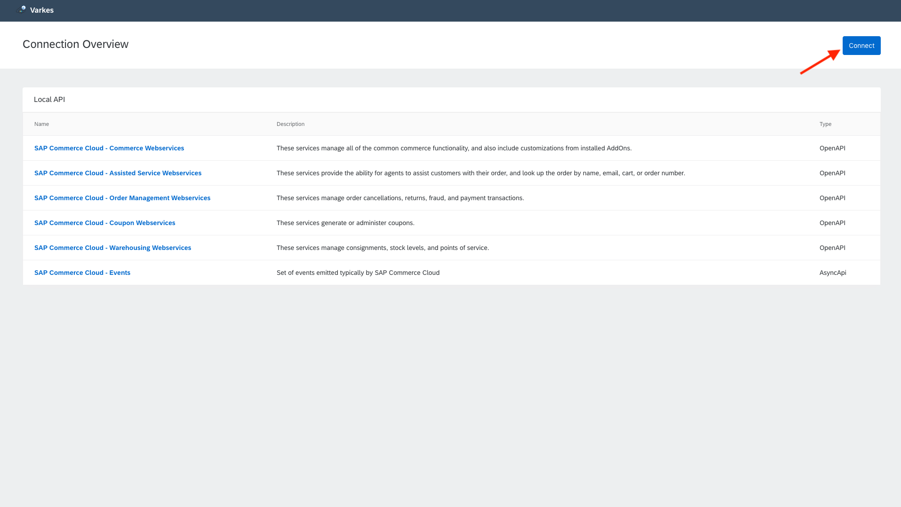

Paste the URL you copied earlier and click on `Connect` to establish the connection:

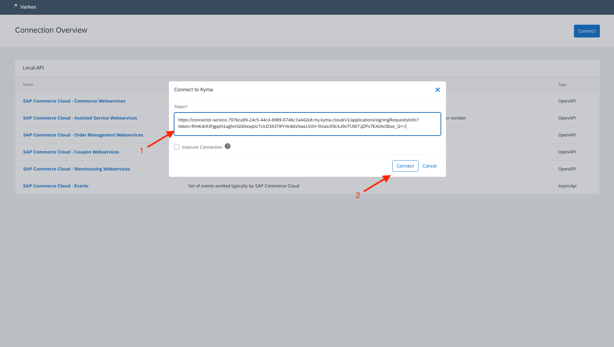

Now the status should be `Connected`. Click on `Register` for `SAP Commerce Cloud - Events`:

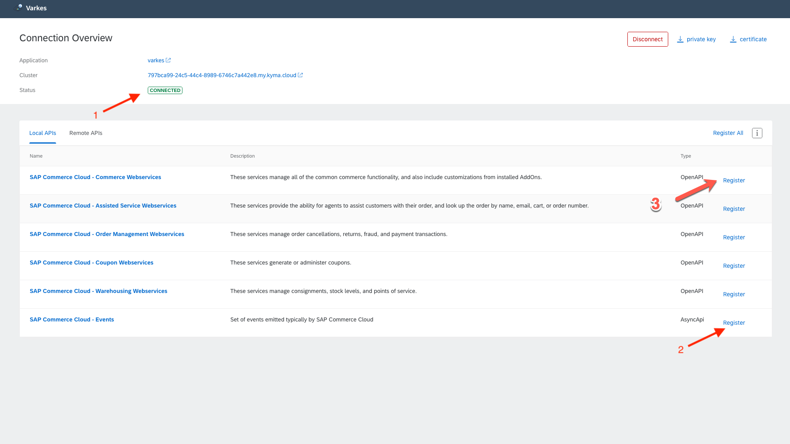

Go back to the `Applications` page on Kyma. Status of `commerce` should be `Serving` now:

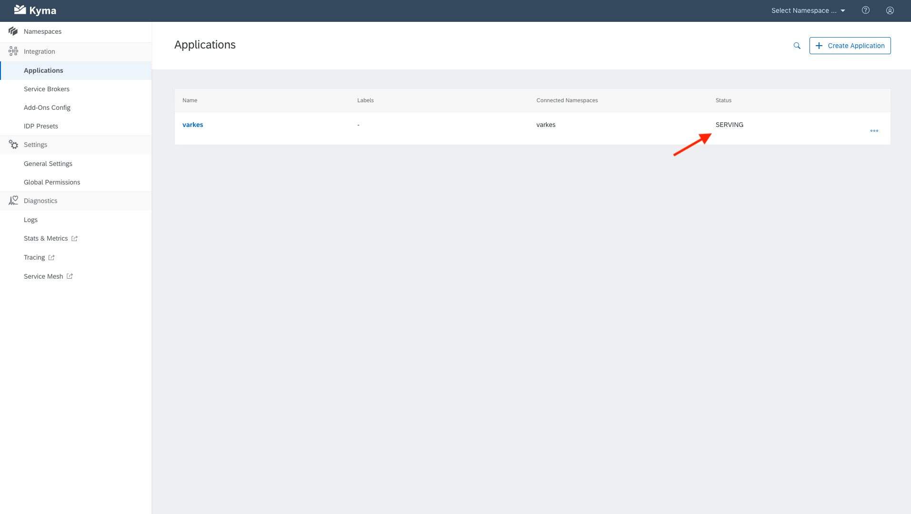